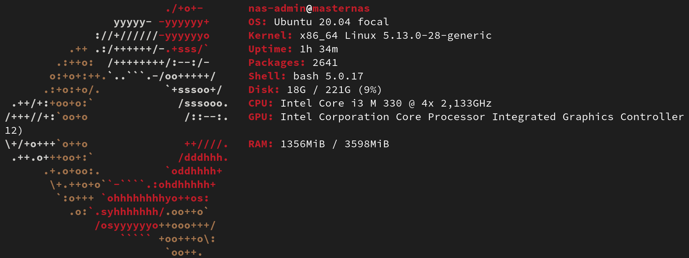
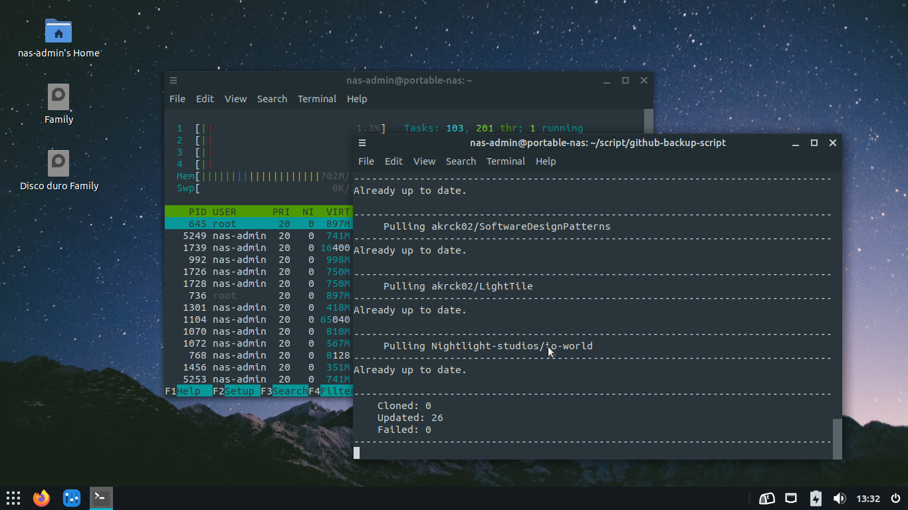

# NAS Project

Hey there! I’m starting this little project to set up a NAS (Network attached storage) at my home.

### Why do I need a NAS.

I actually don’t need any NAS, but I have an old Acer Aspire with the following specs.



And I will bring a new life to this old engine, capable to do some magic.

### How to convert a laptop into NAS

The first thing I need to figure out is what operating system this NAS will be using. I choose Ubuntu for this, but instead of running a headless installation, I will use the laptop big 16’’ screen to show a clean GUI to manage all the stuff locally.

I could have chosen any linux distro like fedora, debian or even lightweight and headless arch instead, but I see Ubuntu a good spot between the debian apt package manager and the fedora performance and stability.

### Configuring Ubuntu Mate UI

First of all, this server can be access locally, so I don’t want the future me driving mad due to ugly UI, so I tweak mate desktop environment with a few goodies.

### Papirus icon theme, the good old classic.

I like papirus modern / flat design, so I install the icons here using.

```bash
sudo add-apt-repository ppa:papirus/papirus
sudo apt-get update
sudo apt-get install papirus-icon-theme
```

### Adapta-nokto, beautiful dark mode.

Yes, I like dark mode UI. Adapta seems simple enough to run well on a 10 year old laptop without issues at all and is beautiful, so here it i our GUI.

```bash
sudo apt-add-repository ppa:tista/adapta 
sudo apt update
sudo apt install adapta-gtk-theme
``` 



# Manage over the network

I will like to manage the NAS sometimes from my reliable MSI modern 14 running fedora. This is my most used computer, and I use it to develop any kind of software, so I will configure ssh on both.

To install the ssh software in ubuntu I run the following command:

```bash
 sudo apt-get install openssh-server ii.
```

I install ssh client on my laptop and connect using the following command

```bash
ssh nas-admin@x.x.x.x
```

<aside>
💡 x.x.x.x represents the NAS IP address and nas-admin the user

</aside>

Here we go, something like this will prompt. **We are in!**

```bash
nas-admin@portable-nas:~$
```

### Accessing via hostname

if you don’t want to use that large IP, I’ve you covered! go to your hosts file on 

**/etc/hosts** and add the following line:

```
x.x.x.x portable-nas
```

So now you can access the NAS with the following friendly hostname 

```
ssh nas-admin@portable-nas
```

[Configuring Network](/pages/1.ConfiguringNetwork.md)

[Storage](/pages/2.Storage.md)

[Github backup](/pages/3.GithubBackup.md)

[Github backup: Update 1](/pages/GithubBackup/1.Scriptv1.0.md)