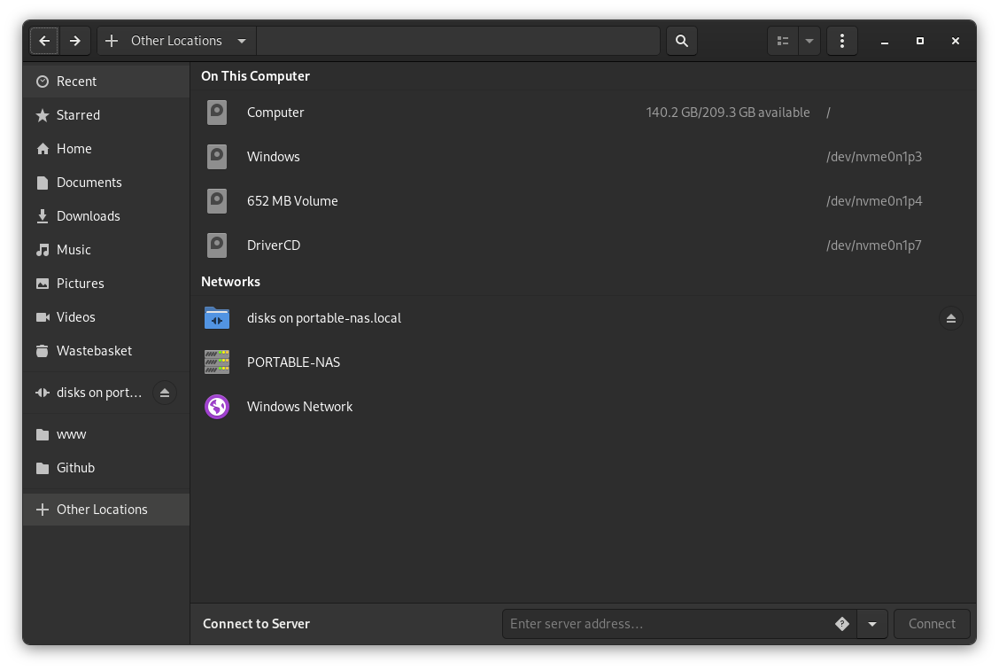

# Configuring Network

Network Attached storage needs, indeed a network, so we need to set up some things.

### Funny fact: The disaster.

In this particular point I’ve follow my own docs to reinstall Ubuntu Mate because I swiped a partition that was accidentally mounted, so no $HOME directory was present. 😭😭.

Okay, so I have a fresh install, follow my own documents and hey! good to go.

## Static IP.

Using a NAS over DHCP causes some problems so I will config an static IP for my nas.

## Samba, The bridge between windows machines and linux.

Yes, I know. You have that question to make. Do you have any Windows machine? Yes, of course I have. But I’m not using any of them to access this NAS (I use them to play games and edit media 😉). The windows compatibility is a MUST in my house because my family have Windows 10 desktop PCs and laptops, so I need this NAS to be fully compatible.

## ¿What the hell is Samba?

Samba is a protocol / software to share files through the network. So we need to install it in order to make the NAS drives accessible to the rest of my family and home devices.

```bash
sudo apt-get install samba
```

Now we need to mount the disks we need to be accesible on the NAS. As my old laptop does have only a 250GB SATA SSD I will test the NAS with a partition (160GB) and then expand that storage with more disks. 

I will cheat here, we will be using gnome disk manager GUI, because it’s simple and fast. So we need to install it

```bash
sudo apt-get install gnome-disk-utility
```

Partition done and mounted, so let’s configure samba. First of all I will make a backup of the configuration file we will be modifying, just in case.

```bash
sudo cp /etc/samba/smb.conf /etc/samba/smb.conf.bak
```

And now we need to modify the configuration file with:

```bash
sudo nano /etc/samba/smb.conf
```

I wrote lines in the file:

```bash
# ======================= Global Settings ============>

[global]
   workgroup = WORKGROUP
   server string = %h server (Samba, Ubuntu)
   socket options = TCP_NODELAY IPTOS_LOWDELAY

# ======================= Share Definitions ==========>
[Family]
   comment = NAS storage family disks.
   path = /mnt/
   browseable = true
   writeable = yes
   create mask = 0775
   directory mask = 0775
   write list = nas-admin
```

It works! Sort of. I can see the NAS from my MSI running fedora and access the disk, but no writing permision is granted..



Enough for today, it’s 2AM so, sleepy time. 😴😴😴

[Back](../README.md)