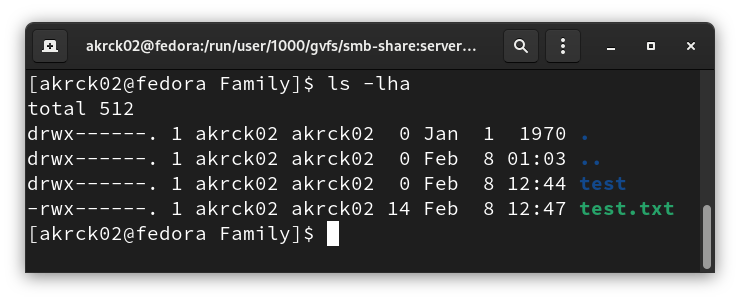
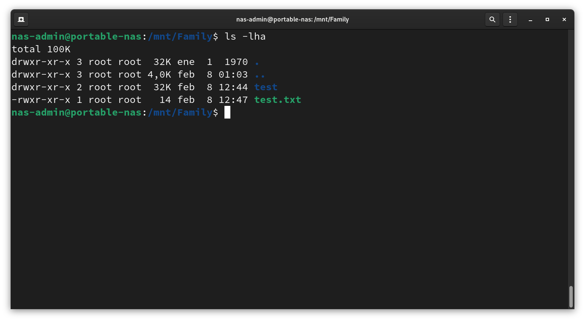
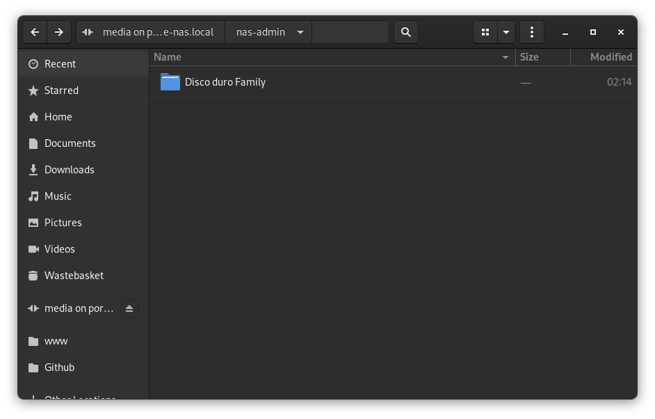
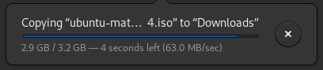
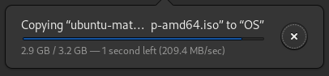

# Storage

Okay today is a new day, so I grabbed a coffee and starting testing things. ☕️

## RAID

RAID stands for Redundant Array of Independent Disks and is a way to handle multiple disks acting like one. There are many types of RAID systems with better performance or better data loss management. In this case, I won’t be using any RAID because I only have a disk connected, but I will do it once I get a better PC to use as a NAS / server and a bunch of disks. 

## Solving permissions issues

I created a folder named Test inside the nas Family disk and a file  with “Hello world” inside using the built in ssh.

I checkout the permissions of the directory from my fedora laptop, results here: 



 

Seems like we don’t have any permision from outsite, so I will check them from the NAS:



Okay it seems that no write permissions are shown, let’s dive in.

### Testing USB drives

I want my NAS to share the usb drives that are connected into the laptop to the rest of the network so I modify the smb.conf file.

```bash
[Media]
  comment = NAS storage USB media.
  path = /media/
	browseable = true
  writeable = yes
  create mask = 0775
  directory mask = 0775
  write list = nas-admin		
```

So now I have total access to my USB HDD. 



## PD: Mount your NAS properly
Okay, I was pissed because I didn’t have any **write access** on my NAS from my fedora laptop and I stay days figuring out how to do it. I search stackoverflow and I found a lot of similar questions, but I couldn’t find a good answer. 

First I tried changing mask permissions to 0777, but it didn’t work.

```text
  create mask = 0777
  directory mask = 0777
```

Okay so I went to the NAS USB drive and changed the permissions to 0777 to.

```bash
  chmod -R 0777 /media/nas-admin/
```

At this point, I was giving up and I checked the permissions again and again. Nothing changed.

Searching for a solution, I found a similar issue on a stackoverflow post without any solution, but a comment of the author telling some days after that he figured out the solution.

*"Ok, figured it out. It wasn't in my samba settings. The error was actually in how I was "permanently" mounting my samba share."*

**I CAN'T BELIEVE THAT WAS THE ANSWER!** But it was.

I go to the fstab file with the following command:

```bash
sudo nano /etc/fstab
```

and add the following line:
```
//x.x.x.x/Media /media/NAS/ cifs username=nas-admin,password=****,file_mode=0777,dir_mode=0777 0 0

```

Okay, that was working fine, so I want to try to mount the SDD to the NAS /media/ folder and test the speed.

I mounted the SSD partition to the NAS with the following command:

```bash
sudo mount /dev/sda2 /media/NAS/internal
```

Read speed:



Write speed:



This was the fastest I could do with the SATA II interface even if this particular SSD was capable of getting 500MB/s.

Even if this may seem slow, it is indeed faster than the USB drive on it, so we win.

In the future, I will try to get a better hardware and storage to create a better NAS with RAID and other features, but this is the first step and I'm pretty happy with the current state.

[Back](../README.md)
